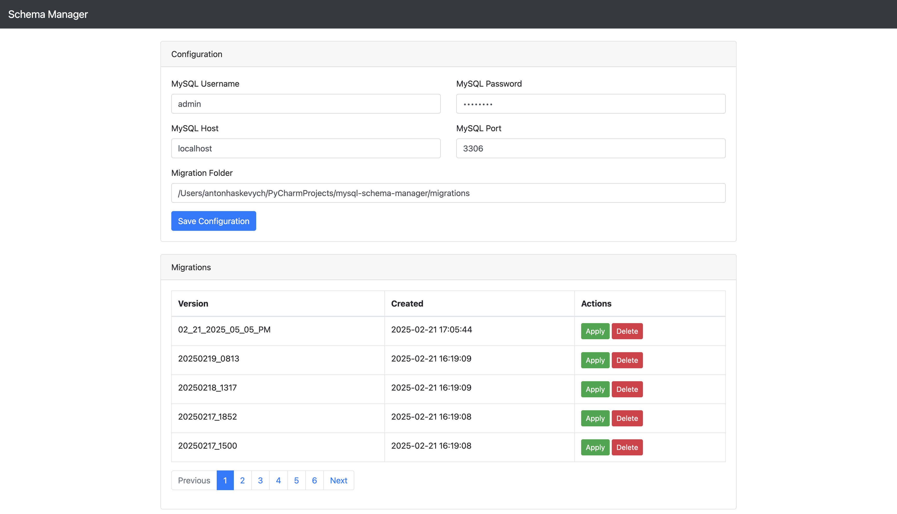

# MySQL Schema Manager

**MySQL Schema Manager** is a web-based tool built with Flask for managing MySQL schemas and migrations in multitenant environments. It streamlines operations for DevOps and database administrators by offering features such as:



- **Configuration Validation:** Ensures proper MySQL credentials and paths before enabling features.
- **Migration Management:** Upload, list, apply, and delete migration versions.
- **Database Backup:** Create backups (dumps) of non-system MySQL databases.
- **Snapshot Application:** Concurrently apply SQL snapshots with progress indication.
- **User-Friendly UI:** Intuitive design with confirmation pages and simulated progress indicators.

---

## Features

- **Configuration:**  
  - Set MySQL username, password, migration folder, and backup folder.
  - Validates connection to MySQL before enabling features.

- **Migrations:**  
  - **Apply Migration Versions:**  
    - Lists available migration versions.
    - Provides a confirmation page listing SQL files in a migration.
    - Executes migrations by creating databases if missing and applying SQL files.
  - **Upload Migrations:**  
    - Supports uploading entire folders or ZIP files containing `.sql` dumps.
  - **Delete Migrations:**  
    - Remove migration versions that are no longer needed.

- **Actions:**  
  - **Drop All Schemas:** Drop all non‑system MySQL databases (use with caution).
  - **Database Dump:**  
    - Backup all non‑system MySQL databases into a timestamped folder.
  - **Apply Snapshots:**  
    - Concurrently process and apply SQL snapshot files with progress feedback.

- **Responsive UI:**  
  - Built with Bootstrap for a modern, responsive layout.
  - Pages are designed to have a minimum height of 100vh for a consistent look.

---

## Requirements

- **Python 3.7+**
- **MySQL Server**
- **Flask**
- **mysql-connector-python**
- **Other dependencies:**  
  - `tqdm` for progress indication  
  - See `requirements.txt` for a complete list.

---

## Installation

1. **Clone the Repository:**

   ```bash
   git clone https://github.com/your-username/mysql-schema-manager.git
   cd mysql-schema-manager
   ```

2. **Create a Virtual Environment:**

   ```bash
   python3 -m venv .venv
   source .venv/bin/activate  # On Windows: .venv\Scripts\activate
   ```

3. **Install Dependencies:**

   ```bash
   pip install -r requirements.txt
   ```

4. **Configure Git Ignore:**  
   Ensure that files/directories such as `/backups`, `/migrations`, `config.json`, `/.venv`, and `/.idea` are excluded by your `.gitignore`.

---

## Configuration

Before using the application, update your configuration using the UI:

1. Start the application and go to the **Configuration** section on the dashboard.
2. Enter your MySQL username, password, and the path to your migration folder.
3. Click **Save Configuration**. The system will attempt to connect to MySQL using your credentials.  
   - **Note:** If the connection fails, you will be prompted to correct your configuration.

The configuration is stored in `config.json` (which is not tracked by Git).

---

## Usage

1. **Start the Application:**

   ```bash
   python app.py
   ```

2. **Access the Dashboard:**  
   Open your browser and navigate to [http://localhost:5000](http://localhost:5000).

3. **Perform Actions:**

   - **Migrations:**  
     - Upload new migration versions.
     - Apply or delete existing migrations.
     - Confirm migration details and track progress during application.
   - **Database Dump:**  
     - Create backups of all non‑system MySQL databases.
   - **Drop Schemas:**  
     - Use with caution; drops all non‑system schemas.

---

## Development

- **Project Structure:**  
  - `app.py`: Main application file with routes and business logic.
  - `templates/`: Contains all Jinja2 templates.
  - `static/`: For custom CSS/JS (if any).
  - `config.json`: Stores user configuration (ignored by Git).
- **Testing:**  
  Write and run unit tests as needed.
- **Contributing:**  
  Contributions are welcome! Feel free to open issues or submit pull requests.

---

## License

This project is licensed under the [MIT License](LICENSE).

---

## Acknowledgments

- Inspired by best practices in Python, Flask, and DevOps automation.
- Thanks to the open source community for the libraries and tools used in this project.
